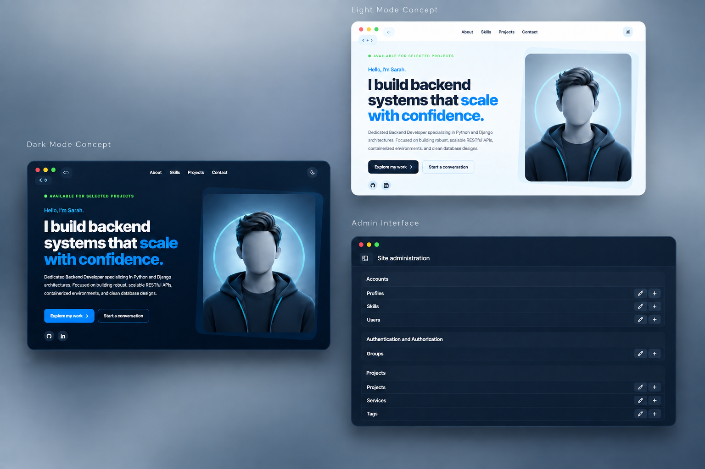

# Django Portfolio & Showcase Platform

An open-source, production-ready full-stack platform engineered for developers to showcase their professional journey. Built with **Django**, **PostgreSQL**, and **Tailwind CSS**, the entire ecosystem is fully containerized using **Docker** for seamless deployment.

Featuring a modular architecture, robust test coverage, and a streamlined admin experience via **Django Unfold**, this platform is designed to bridge the gap between local development and production-grade hosting.

---

<div align="center">
  
</div>

<br>

---

## ✨ Key Features

### 🏗️ Core Functionality

- **Project Showcase:** Dynamic rendering of case studies and technical projects.
- **Rich Content Management:** Support for multi-image galleries and structured technical details via Django Admin.
- **Skill Matrix:** Highlighting tech stacks per project for better visibility.
- **Internationalization (i18n):** Architecture prepared for multi-language support.

### 🛠️ Engineering Excellence

- **Containerized Ecosystem:** Fully orchestrated via Docker and Docker Compose.
- **Robust Testing:** Comprehensive unit and integration tests for model integrity and view logic.
- **Automated Superuser & Seeding:** Custom idempotent Management Commands to populate baseline categories and admin users safely.
- **Strict Security:** Production-ready configuration for environment variables and cryptographic keys.
- **Automated Workflows:** Streamlined via `GNU Make` for one-command development and deployment.

---

## 🚀 Tech Stack & Architecture

| Layer        | Technology                  | Purpose                          |
| :----------- | :-------------------------- | :------------------------------- |
| **Backend**  | `Python 3.13`, `Django 5.x` | Core logic and ORM               |
| **Database** | `PostgreSQL 16`             | Persistent relational storage    |
| **DevOps**   | `Docker`, `Docker Compose`  | Containerization & Orchestration |
| **Workflow** | `Poetry`, `GNU Make`        | Dependency & Task Automation     |
| **Frontend** | `Tailwind CSS`, `Django Templates` | Responsive UI/UX          |

---

## 📂 Project Structure

```text
.django-portfolio/
├── app/
│   ├── accounts/          # Custom user management & authentication
│   ├── config/            # Project settings & WSGI/ASGI
│   ├── core/              # Shared utilities & base models
│   ├── projects/          # Core business logic (Projects, Tags, etc.)
│   ├── media/             # User-uploaded files
│   ├── static/            # Global static assets
│   └── templates/         # Django HTML templates
├── docker/                # Dockerfiles and environment configs
├── Makefile               # Task automation scripts
├── pyproject.toml         # Poetry dependencies
└── .env.example           # Template for environment variables
```

---

## 🛠️ Getting Started (Development)

### 1. Prerequisites

Ensure you have [Docker](https://docs.docker.com/get-docker/) and [GNU Make](https://www.gnu.org/software/make/) installed on your machine.

### 2. Setup Environment

```bash
# Clone the repository
git clone https://github.com/your-username/your-repo.git
cd your-repo

# Create your local environment file
cp .env.example .env
```

Generate a secure, high-entropy secret key and paste it into `SECRET_KEY` inside `.env`:

```bash
python -c "import secrets; print(secrets.token_urlsafe(50))"
```

> **Note:** Open `.env` and verify your database credentials and superuser details before building containers. Never commit your `.env` file to version control.

### 3. Orchestrate Development Environment

Use the provided `Makefile` to spin up and bootstrap the entire application stack:

```bash
# Build and launch all services in detached mode
make dev-build

# Apply database migrations
make dev-migrate

# Seed initial baseline data and create default superuser
make dev-seed
```

The application will be live at: `http://localhost:8000`

---

## 🔐 Admin Dashboard Access

The platform includes a modern, responsive administrative control panel powered by **Django Unfold**.

* **Admin Portal URL:** `http://localhost:8000/admin/`
* **Automatic Provisioning:** During the `make dev-seed` in Development mood or `make prod-seed` in Production mood  process, a superuser account is automatically provisioned for you.
* **Default Credentials:** The system uses the variables defined in your `.env` file to create this account:
  * **Email / Username:** `ADMIN_EMAIL`
  * **Password:** `ADMIN_PASSWORD`


## 🏗️ Production Deployment

The project follows the **Twelve-Factor App** methodology, strictly separating application configuration from code.

### Deployment Workflow

```bash
# Build optimized production images
make prod-build

# Run migrations on the production database
make prod-migrate

# Seed production data (if required)
make prod-seed
```

**Production Security Checklist:**

- [ ] Set `SECRET_KEY` to a unique, cryptographically secure 50+ character string.
- [ ] Explicitly specify your production domain(s) in `ALLOWED_HOSTS`.
- [ ] Configure `SECURE_SSL_REDIRECT` and `CSRF_TRUSTED_ORIGINS` for HTTPS traffic.

---

## 🎮 Automation with Makefile

The `Makefile` abstracts multi-step Docker invocations into simple commands:

| Command            | Action                                              |
| :----------------- | :-------------------------------------------------- |
| `make dev`         | Start existing development containers               |
| `make dev-build`   | Rebuild images and launch development containers    |
| `make dev-migrate` | Execute Django database migrations inside container |
| `make dev-seed`    | Run idempotent database seeding & superuser setup   |
| `make dev-down`    | Stop and remove development containers              |
| `make prod-build`  | Build optimized production container images         |
| `make clean-all`   | **Destructive:** Removes all containers, images, and DB volumes |

---

## 📦 Dependency Management

We use **Poetry** for deterministic dependency locking across all environments.

```bash
# Add a new runtime dependency
poetry add <package-name>

# Add a development-only dependency
poetry add --group dev <package-name>
```

---

## 👩‍💻 Author

**Sarah Golabvand**  
*Backend Developer focused on building clean, reliable APIs and well-structured database systems.*

[](https://linkedin.com/in/sarah-golabvand)
[](https://github.com/SarahGolabvand)

---

<div align="center">
  <sub>Designed with precision. Built for reliability.</sub>
</div>
