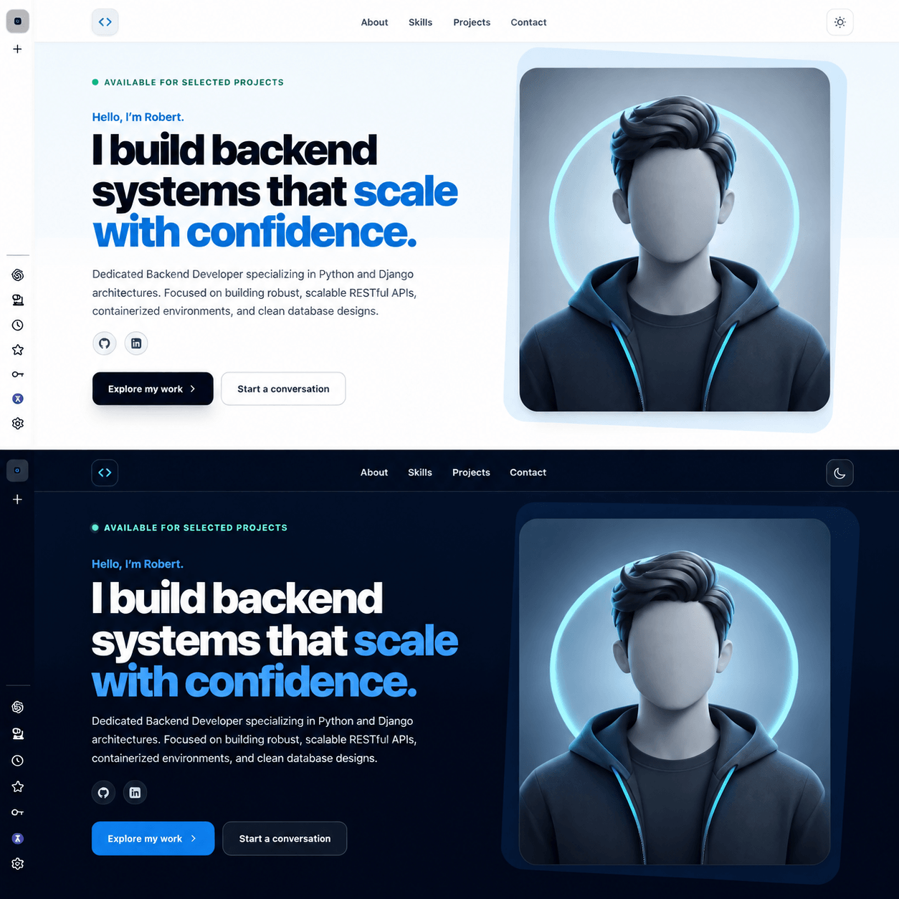
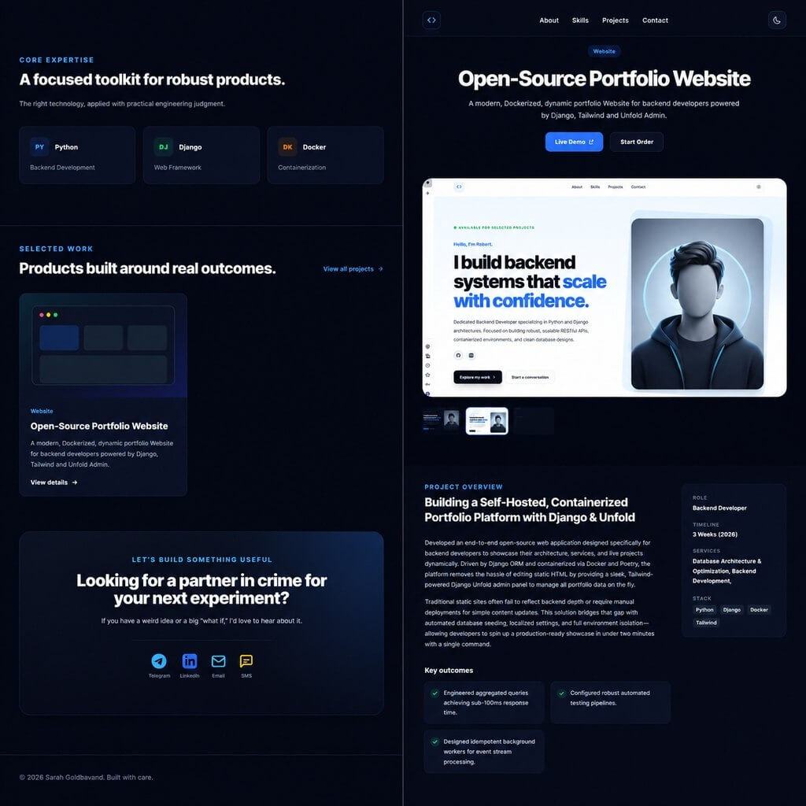
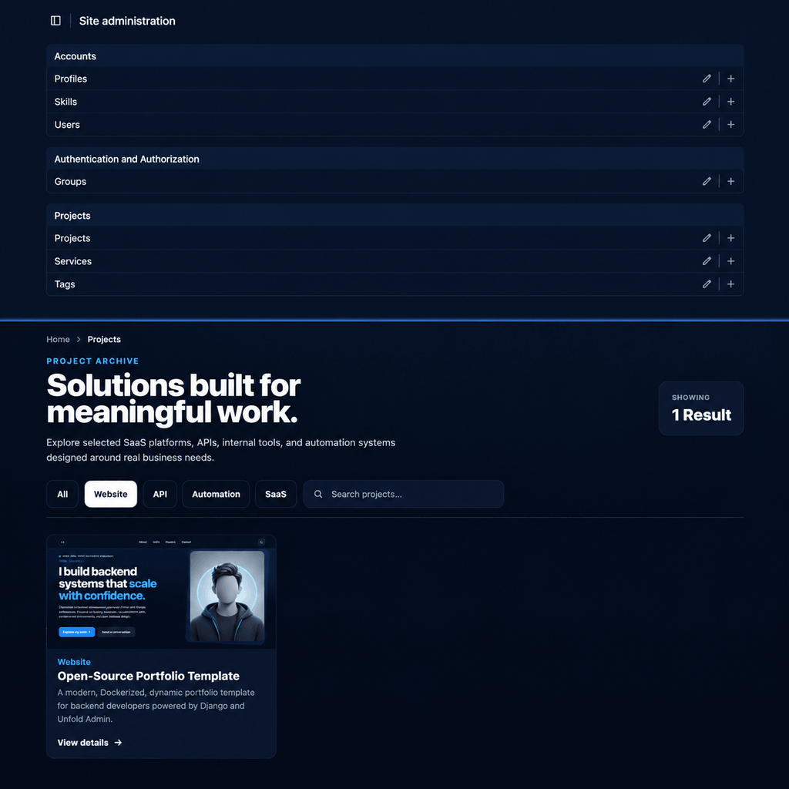

# Django Portfolio & Showcase Platform

An open-source, production-ready full-stack platform engineered for developers to showcase their professional journey. Built with **Django**, **PostgreSQL**, and **Tailwind CSS**, the entire ecosystem is fully containerized using **Docker** for seamless deployment.

Featuring a modular architecture, robust test coverage, and a streamlined admin experience via **Django Unfold**, this platform is designed to bridge the gap between local development and production-grade hosting.

---

<div align="center">
  
</div>

<br>

## 📸 Visual Overview

### Interface Preview

<div align="center">
  
  
</div>

---

## ✨ Key Features

### 🏗️ Core Functionality

- **Project Showcase:** Dynamic rendering of case studies and technical projects.
- **Rich Content Management:** Support for multi-image galleries and structured technical details.
- **Skill Matrix:** Highlighting tech stacks per project for better visibility.
- **Internationalization (i18n):** Architecture prepared for multi-language support.

### 🛠️ Engineering Excellence

- **Containerized Ecosystem:** Fully orchestrated via Docker and Docker Compose.
- **Robust Testing:** Comprehensive unit and integration tests for model integrity and view logic.
- **Idempotent Data Seeding:** Custom Management Commands to ensure consistent development environments.
- **Strict Security:** Production-ready configuration for environment variables and sensitive data.
- **Automated Workflows:** Streamlined via `GNU Make` for one-command development and deployment.

---

## 🚀 Tech Stack & Architecture

| Layer        | Technology                  | Purpose                          |
| :----------- | :-------------------------- | :------------------------------- |
| **Backend**  | `Python 3.13`, `Django 6.x` | Core logic and ORM               |
| **Database** | `PostgreSQL 16`             | Persistent relational storage    |
| **DevOps**   | `Docker`, `Docker Compose`  | Containerization & Orchestration |
| **Workflow** | `Poetry`, `GNU Make`        | Dependency & Task Automation     |
| **Frontend** | `Tailwind CSS`, `JS`        | Responsive UI/UX                 |

---

## 📂 Project Structure

```text
.django-portfolio/
├── app/
│   ├── accounts/           # Custom user management
│   ├── config/             # Project settings & WSGI/ASGI
│   ├── core/               # Shared utilities & base models
│   ├── projects/           # Core business logic (Projects, Tags, etc.)
│   ├── media/              # User-uploaded files
│   ├── static/
│   ├──.env.example         # Global static assets
│   └── templates/.         # Django HTML templates           

├── docker/                # Dockerfiles and environment configs
├── Makefile               # Task automation scripts
├── pyproject.toml         # Poetry dependencies
└── .env.example           # Template for environment variables
```

---

## 🛠️ Getting Started (Development)

### 1. Prerequisites

Ensure you have [Docker](https://docs.docker.com/get-docker/) and [GNU Make](https://www.gnu.org/software/make/) installed.

### 2. Setup Environment

```bash
# Clone the repository
git clone https://github.com/SarahGolabvand/modern-portfolio.git
cd your-repo

# Create environment file
cp .env.example .env
```

> **Note:** Edit `.env` to configure your local credentials. Never commit your real `.env` file.

### 3. Orchestrate Development Environment

Use the provided `Makefile` to handle complex Docker commands effortlessly:

```bash
# Build and launch all services
make dev-build

# Apply database migrations
make dev-migrate

# Seed the database with initial data
make dev-seed
```

The application will be available at: `http://localhost:8000`

---

## 🏗️ Production Deployment

The project follows a **Twelve-Factor App** methodology, ensuring a strict separation of config from code.

### Deployment Workflow

```bash
# Build optimized production images
make prod-build

# Run migrations on the production database
make prod-migrate

# Seed production data (if required)
make prod-seed
```

**Production Checklist:**

- [ ] Update `DJANGO_SECRET_KEY` to a high-entropy string.
- [ ] Configure `ALLOWED_HOSTS` with your domain.
- [ ] Set `DEBUG=False`.
- [ ] Ensure `SECURE_SSL_REDIRECT` and `CSRF_TRUSTED_ORIGINS` are configured for HTTPS.

---

## 🎮 Automation with Makefile

The `Makefile` abstracts complex Docker commands into simple, intuitive tasks.

| Command            | Action                                              |
| :----------------- | :-------------------------------------------------- |
| `make dev`         | Start development containers                        |
| `make dev-build`   | Rebuild and start dev environment                   |
| `make dev-migrate` | Run Django migrations                               |
| `make dev-seed`    | Execute idempotent data seeding                     |
| `make dev-down`    | Stop and remove dev containers                      |
| `make prod-build`  | Build optimized production images                   |
| `make clean-all`   | **Destructive:** Removes all containers and volumes |

---

## 📦 Dependency Management

We use **Poetry** for deterministic dependency management. This ensures that every developer and every environment (Dev/Prod) uses the exact same package versions, preventing the "it works on my machine" syndrome.

```bash
# To add a new dependency
poetry add <package-name>
```

---

## 👩‍💻 Author

**Sarah Golabvand**
_Backend Engineer specializing in scalable and reliable systems._

[](https://linkedin.com/in/sarah-golabvand)
[](https://github.com/SarahGolabvand)

---

<div align="center">
  <sub>Designed with precision. Built for reliability.</sub>
</div>
