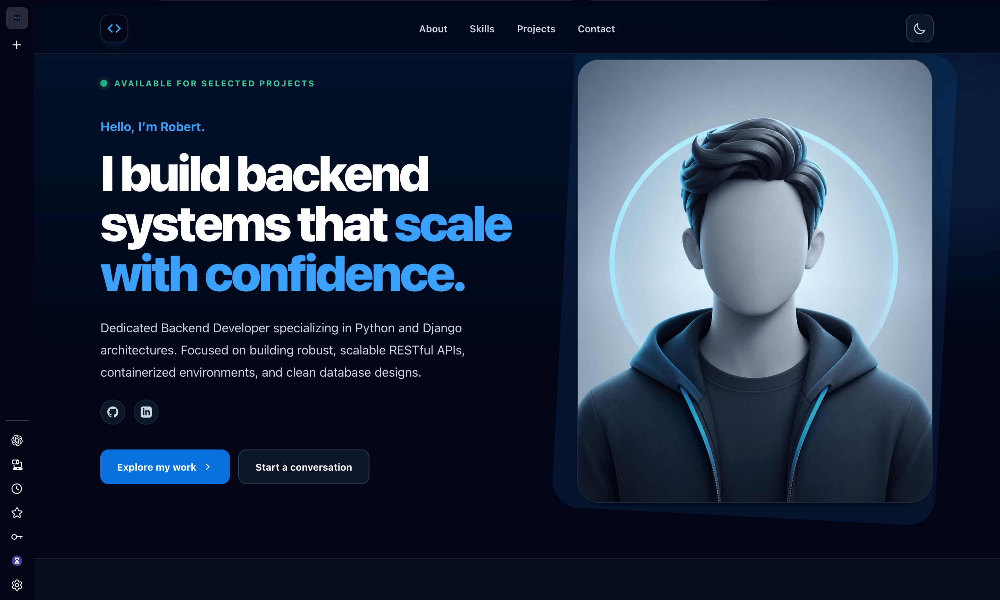
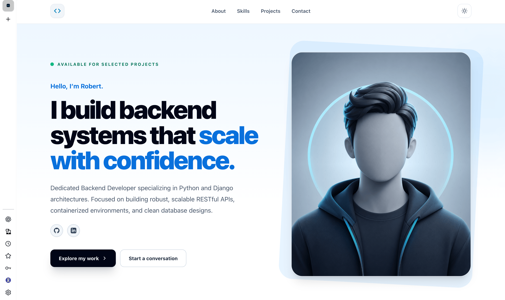

# Django Portfolio & Showcase Platform

A containerized personal portfolio and project showcase platform built with **Django**, **PostgreSQL**, and **Docker**.

The platform is designed to present projects, technical skills, experience, and case studies through a clean and maintainable architecture, while providing a fully containerized development and production workflow.

---

<div align="center">

  

</div>

<br>

## 📸 Screenshots

### Portfolio Overview

<div align="center">

  
  

<br><br>

  
  

</div>

---

## ✨ Features

* 🧩 Project showcase and detailed case studies
* 📝 Rich project descriptions and structured content
* 🖼️ Multiple images for each project
* 🛠️ Skills and technology showcase
* 🌍 Internationalization-ready architecture
* 🔐 Django authentication and admin interface
* 🗄️ PostgreSQL database
* 🐳 Dockerized development and production environments
* ⚡ Optimized multi-stage Docker build
* ⚙️ Automated workflows through GNU Make
* 📦 Dependency management with Poetry
* 🔄 Database migration and initial data seeding
* 🔒 Production-oriented configuration and security practices

---

## 🚀 Tech Stack & Architecture

| Technology                  | Purpose                             |
| --------------------------- | ----------------------------------- |
| **Python 3.13**             | Programming language                |
| **Django 5.x**              | Web framework                       |
| **PostgreSQL 16**           | Relational database                 |
| **Poetry**                  | Dependency management               |
| **Docker**                  | Containerization                    |
| **Docker Compose**          | Multi-container orchestration       |
| **GNU Make**                | Development & deployment automation |
| **HTML / CSS / JavaScript** | Frontend                            |

### Architecture

The application follows a modular Django architecture with separate configuration, core functionality, and feature-specific applications.

```text
Client
   │
   ▼
Django
   │
   ├── Core
   ├── Projects
   ├── Portfolio
   └── Configuration
          │
          ▼
      PostgreSQL
```

---

## 📂 Project Structure

```text
.django-portfolio/
│
├── app/
│   ├── accounts/
│   ├── config/
│   ├── core/
│   ├── media/
│   ├── projects/
│   ├── static/
│   ├── staticfiles/
│   └── templates/
│
├── docker/
│
├── docs/
│   └── screenshots/
│       ├── hero.png
│       ├── home.png
│       ├── projects.png
│       ├── project-detail.png
│       └── admin.png
│
├── .env
├── .env.sample
├── .dockerignore
├── .gitignore
├── LICENSE
├── Makefile
├── poetry.lock
├── pyproject.toml
└── README.md
```

---

## 🛠️ Quick Start

### Prerequisites

Make sure the following are installed:

* [Docker](https://docs.docker.com/get-docker/)
* [Docker Compose](https://docs.docker.com/compose/)
* [GNU Make](https://www.gnu.org/software/make/)

### 1. Clone the repository

```bash
git clone https://github.com/your-username/your-repository.git
cd your-repository
```

### 2. Configure environment variables

Copy the example environment file:

```bash
cp .env.example .env
```

Update `.env` with your local configuration.

Example:

```env
DEBUG=True

POSTGRES_DB=portfolio
POSTGRES_USER=portfolio
POSTGRES_PASSWORD=change-me
POSTGRES_HOST=db
POSTGRES_PORT=5432

DJANGO_SECRET_KEY=change-me
```

> Never commit real secrets, passwords, API keys, or production credentials to Git.

### 3. Build the development environment

```bash
make dev-build
```

### 4. Start the application

```bash
make dev
```

### 5. Apply database migrations

```bash
make dev-migrate
```

### 6. Seed initial data

```bash
make dev-seed
```

The application will be available at:

```text
http://localhost:8000
```

---

## 🎮 Makefile Commands

Common development and deployment workflows are available through the `Makefile`.

| Command            | Description                                          |
| ------------------ | ---------------------------------------------------- |
| `make dev`         | Start development containers                         |
| `make dev-build`   | Rebuild images and start the development environment |
| `make dev-migrate` | Apply database migrations                            |
| `make dev-seed`    | Populate the database with initial data              |
| `make dev-down`    | Stop development containers                          |
| `make prod-build`  | Build the production image                           |
| `make prod-static` | Run Django `collectstatic`                           |
| `make clean-all`   | Remove containers, networks and database volumes     |

> ⚠️ `make clean-all` is destructive and removes persistent database volumes.

---

## 🐳 Docker

The project uses a multi-stage Docker build to separate dependency compilation from the runtime environment.

### Build stages

```text
Builder Stage
    │
    ├── Install build dependencies
    ├── Install Poetry
    ├── Install Python dependencies
    │
    ▼
Runtime Stage
    │
    ├── python:3.13-slim
    ├── Application dependencies
    ├── Django application
    └── Non-root user
```

### Container optimization

* Multi-stage Docker build
* Build dependencies excluded from the runtime image
* `python:3.13-slim` runtime image
* Non-root application user
* Persistent PostgreSQL volume
* Separate static files volume
* Environment-based configuration

---

## 🗄️ Database

The application uses **PostgreSQL 16** as its primary relational database.

Database configuration is provided through environment variables rather than being hard-coded into the application.

This allows the same application image to be used across different environments:

```text
Development
     │
     ▼
PostgreSQL

Production
     │
     ▼
PostgreSQL
```

---

## 🌍 Internationalization

The application is structured to support multiple languages and can be extended with Django's internationalization framework.

The architecture is prepared for:

* Translatable interface strings
* Locale-aware formatting
* Multiple language support
* Future RTL language support

---

## 🔐 Security

Production configuration is designed around Django security best practices, including:

* Environment-based secrets
* Secure cookie configuration
* CSRF protection
* Host validation
* Debug disabled in production
* Non-root Docker container
* PostgreSQL credentials stored outside the source code

Before deploying to production, review Django's deployment checklist and configure HTTPS, allowed hosts, trusted origins, and secure cookies appropriately.

---

## 📊 Project Showcase

Each portfolio project can contain:

* Project title
* Short description
* Detailed case study
* Technologies used
* Project images
* GitHub repository
* Live demo
* Development status
* Additional metadata

Example:

```text
Project
│
├── Title
├── Description
├── Case Study
├── Technologies
├── Images
├── GitHub URL
└── Live Demo URL
```

---

## 🧪 Development Workflow

A typical development workflow looks like this:

```text
Clone Repository
       │
       ▼
Configure .env
       │
       ▼
make dev-build
       │
       ▼
make dev
       │
       ▼
make dev-migrate
       │
       ▼
make dev-seed
       │
       ▼
Develop & Test
       │
       ▼
Production Build
```

---

## 📦 Package Management

Python dependencies are managed using **Poetry**.

Project dependencies and metadata are defined in:

```text
pyproject.toml
```

The exact dependency versions are locked in:

```text
poetry.lock
```

This provides reproducible dependency installation across environments.

---

## 🚀 Production

Build the production image:

```bash
make prod-build
```

Collect static files:

```bash
make prod-static
```

Before deploying, configure production environment variables and verify:

* `DEBUG=False`
* Strong `DJANGO_SECRET_KEY`
* Correct `ALLOWED_HOSTS`
* PostgreSQL credentials
* HTTPS
* Secure cookies
* CSRF trusted origins
* Static/media storage
* Database backups

---

## 🗺️ Roadmap

* [x] Django project setup
* [x] PostgreSQL integration
* [x] Docker development environment
* [x] Multi-stage Docker build
* [x] Project showcase
* [x] Multiple project images
* [x] Django Admin integration
* [ ] Authentication improvements
* [ ] Contact form
* [ ] Email integration
* [ ] Project filtering
* [ ] Search functionality
* [ ] Analytics dashboard
* [ ] Automated tests
* [ ] CI/CD pipeline
* [ ] Production deployment

---

## 👩‍💻 Author

**Sarah Golaband**

* LinkedIn: [linkedin.com/in/sarahgolaband](https://linkedin.com)
* GitHub: [@your-username](https://github.com)

---

## 📄 License

This project is available for educational and portfolio purposes.

If you plan to reuse or distribute the code, please add an appropriate license to the repository.
